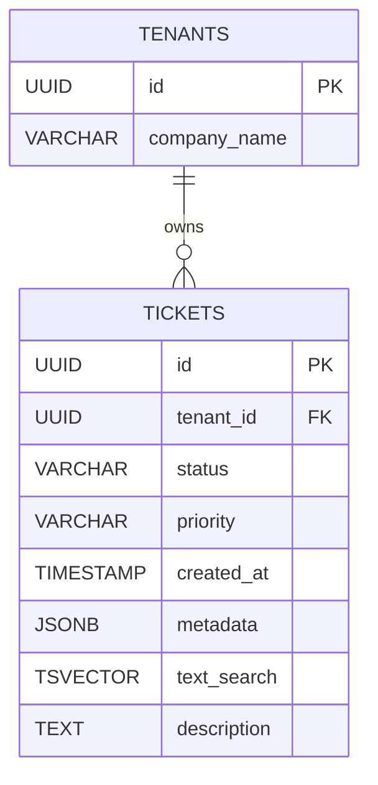

# 🚀 PostgreSQL Query Optimization & Multi-Tenant Architecture

## 📌 Overview
This project is a Backend Architecture Case Study demonstrating production-level database optimization. I designed a multi-tenant PostgreSQL schema simulating a SaaS Support Copilot platform, engineered a high-throughput Python data pipeline to batch-ingest hundreds of thousands of synthetic records, and used `EXPLAIN ANALYZE` to identify and resolve critical $O(N)$ query bottlenecks. 

By strategically applying B-Trees, Partial Indexes, Generalized Inverted Indexes (GIN), and `tsvector` text search, **query latency was reduced by over 99% across the board.**

## 🏗️ Architecture & Schema
The database uses a strict multi-tenant architecture, isolating customer data using UUID-based Foreign Keys. 

## ⚙️ Data Ingestion Pipeline

To mimic real-world production load, the database was populated using a custom Python ingestion engine (`generate_data.py`).

* Utilized `psycopg2.extras.execute_values` to batch-insert records in chunks of 20,000.
* Minimized network latency and connection overhead to efficiently push massive data volumes to a remote cloud database (Supabase).

## 📊 Optimization Benchmarks

The core of this project involved diagnosing slow queries using PostgreSQL's Query Planner and applying the correct data structure to solve the bottleneck.

| Scenario | Algorithmic Bottleneck | Optimization Applied | Before Latency | After Latency | Speedup |
| --- | --- | --- | --- | --- | --- |
| **1. Multi-Tenant Dashboard** | $O(N)$ Seq Scan on FK | B-Tree Composite Index | ~7,000 ms | 66 ms | **~106x** |
| **2. Priority Queue Engine** | High RAM & Index Bloat | Partial Index (`WHERE status='open'`) | ~3,500 ms | 0.17 ms | **~20,000x** |
| **3. JSONB Containment** | Low Selectivity | *See Analysis Below* | ~19,000 ms | ~19,000 ms | **N/A** |
| **4. Full-Text Search** | Leading Wildcard (`%word`) | `tsvector` + GIN Inverted Index | 561 ms | 2.74 ms | **~200x** |
| **5. N+1 Aggregation** | Missing FK Index / Hash Join | B-Tree Foreign Key Index | ~1,200 ms | 191 ms | **~6x** |

## 🔬 Deep Dive: The "Selectivity" Trap (Challenge 3)

During the JSONB optimization challenge, a GIN index was applied to search for tickets where `metadata @> '{"os": "Linux"}'`. Despite the index existing, the query took 19 seconds.

**The Diagnosis:** This was not a failure of the index, but a feature of the Query Planner. The synthetic data distributed the "Linux" OS to exactly 25% of the records. PostgreSQL calculated that performing 250,000 random I/O jumps via a Bitmap Index Scan would be computationally *more expensive* than simply reading the table sequentially from top to bottom.

**The Takeaway:** Indexes are optimized for high-selectivity queries (finding needles in haystacks). When selectivity is low (finding hay in a haystack), a Sequential Scan is mathematically superior.

## 🧠 Core Engineering Concepts Demonstrated

* **Time Complexity in Databases:** Translating slow $O(N)$ linear table scans into $O(\log N)$ tree traversals.
* **Partial Indexing:** Conserving server RAM and preventing index bloat by cataloging only active/pending states in queue systems.
* **Lexemes & Full-Text Search:** Bypassing the limitations of B-Trees for unstructured text by tokenizing paragraphs into `tsvector` and querying them in $O(1)$ time via a GIN inverted index.
* **Multi-Version Concurrency Control (MVCC):** Understanding database bloat, the difference between `DELETE` and `TRUNCATE`, and disk space management in cloud environments.

## 🚀 How to Run

1. Clone this repository.
2. Ensure you have a PostgreSQL instance running (local or cloud).
3. Run `schema_and_indexes.sql` to generate the tables.
4. Update the `DB_URI` in `generate_data.py` with your database credentials.
5. Run `python generate_data.py` to ingest the synthetic data.
6. Execute the `EXPLAIN ANALYZE` queries provided in the SQL file to view the Query Planner's live metrics.
